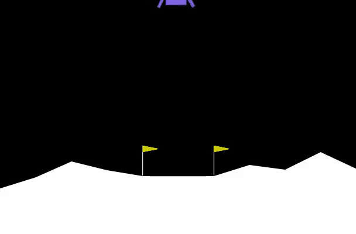
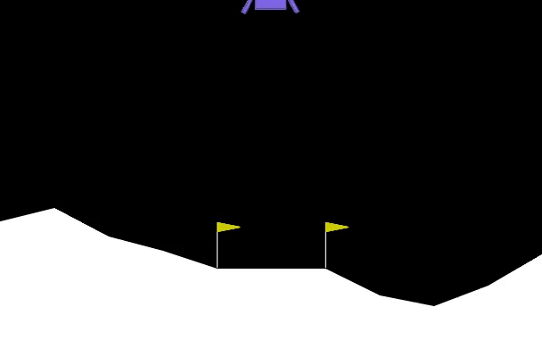
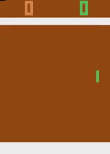
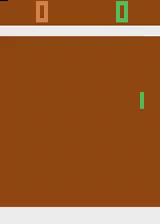
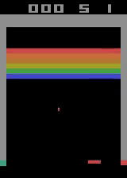
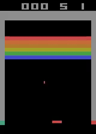
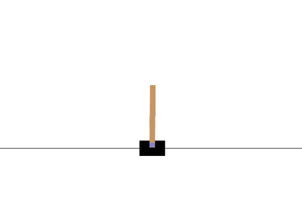
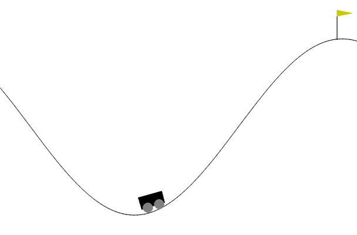
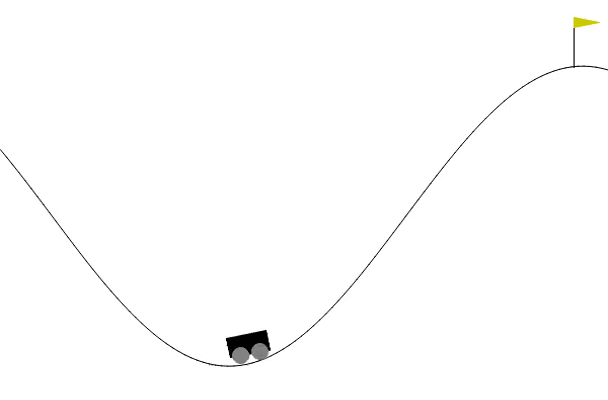

<b>Reinforcement Learning Experiments from Scratch</b> 
<i>Code for implementations of Deep Reinforcement Learning Algorithms from scratch using Pytorch</i>

<b>Agents before (left) and after training (right)</b>

  
  &nbsp;&nbsp;&nbsp;
  

  
  &nbsp;&nbsp;&nbsp;
  

  
  &nbsp;&nbsp;&nbsp;
  

  
  &nbsp;&nbsp;&nbsp;
  

  
  &nbsp;&nbsp;&nbsp;
  

